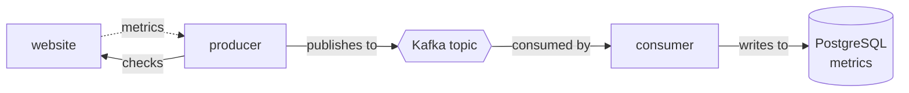

# Aiven Take Home Test

This repository contains the solution for coding assignment for a backend developer
position at Aiven.

The solution consists of two different applications:
- a producer which checks periodically a list of websites and publishes those metrics to a Kafka topic
- a consumer which subscribes to the Kafka topic and writes those metrics to a PostgreSQL table.


## Applications

### Producer

The `producer` application performs a check on each configured `website`, every `check_interval` seconds.
Those checks are performed in parallel, as each check runs on its own thread.
The response content of each website is checked against a `regex` configured for each website.

The checks created are then published into the Kafka topic `kafka_topic`, in json format.
This is the schema of the metrics published:
- `name` (string): name of the website
- `url` (string): url of the website
- `response_time` (float): how many milliseconds it took to respond
- `status_code` (int): HTTP status code of the response
- `regex` (string): regex used for checking the response content
- `regex_check` (boolean): true if the regex matched the content of the response, false otherwise
- `timestamp` (string, iso utc format): timestamp of when the check was performed

### Consumer

The `consumer` reads metrics from `kafka_topic` and writes them to the `metrics` table of the PostgreSQL database.
`metrics` table contains the following columns:
- `name` TEXT
- `url` TEXT
- `response_time` FLOAT
- `status_code` INT
- `regex` TEXT
- `regex_check` BOOLEAN
- `timestamp` TIMESTAMP

## Setup

### Prerequisites
- Python 3.10
  - necessary for development and running the application locally
- [Poetry 1.1](https://python-poetry.org)
  - necessary only for development
- [Dbmate](https://github.com/amacneil/dbmate)
  - for running the database migrations locally
- Docker
  - for running both applications and tests without having to configure anything else

### Aiven

#### Certificates
The only certificate needed is the CA Certificate. For convenience, this certificate is already stored
in this repository in the `certificates` folder, and it's also copied inside the Docker images during builds.

#### Kafka
Authentication to Kafka happens through SASL-SSL.
You can configure SASL on an Aiven Kafka service by setting the advanced configuration `kafka_authentication_methods.sasl`.
Setting `kafka.auto_create_topics_enable` is also necessary in order for the integration tests to run properly.

#### Postgres
`consumer` application will write to a table called `metrics`. This table will be automatically
created if the application is launched through the scripts described in the following sections.
The migrations are handled by `dbmate` and their files are available in the `db` folder.

### Configuration
In order to run both applications and also the integration tests, it is required to set up
an environment file.
For running the applications you should place an `.env` file in the root of the repository,
with the following variables:
```
KAFKA_BOOTSTRAP_SERVERS="Kafka Service URI"
KAFKA_USERNAME="Kafka SASL username"
KAFKA_PASSWORD="Kafka SASL password"
KAFKA_TOPIC="Kafka topic"
KAFKA_CONSUMER_GROUP="Kafka consumer group"
REQUEST_TIMEOUT="Timeout in seconds for website checking"
DATABASE_URL="PostgreSQL Service URI"
# "See `Websites configuration` section"
WEBSITES=[{"name":"google", "url": "https://google.com", "regex": "google"}, {"name":"aiven", "url": "https://aiven.io", "regex": "ai"}]
LOG_LEVEL="ERROR/WARNING/INFO/DEBUG"
CHECK_INTERVAL="Interval in seconds for running the checks"
```

#### Websites configuration

In order to perform a website check, you need to configure the following variables.
- `name`: name of the website
- `url`: url of the website
- `regex`: regex used for checking the response content

Multiple websites can be checked in parallel. The configuration for those websites can be expressed as a list of json
objects. Example:

```json
[{"name":"google", "url": "https://google.com", "regex": "google"}, {"name":"aiven", "url": "https://aiven.io", "regex": "ai"}]
```

## Tests

Tests are available in the `tests` folder. Included tests contain unit and integration tests.
Integration tests are run using Kafka and PostgreSQL Aiven instances.

### Configuration

In order to run integration tests, an `.env` file is required inside the `tests` folder:
```
KAFKA_BOOTSTRAP_SERVERS="Kafka Service URI"
KAFKA_USERNAME="Kafka SASL username"
KAFKA_PASSWORD="Kafka SASL password"
KAFKA_TOPIC="Kafka topic"
KAFKA_CONSUMER_GROUP="Kafka consumer group"
DATABASE_URL="PostgreSQL Service URI"
LOG_LEVEL="ERROR/WARNING/INFO/DEBUG"
```

### Run tests

#### Docker
```shell
./test_docker.sh
```

#### Local environment
```shell
make test
```

## How to run
### Docker
**Producer**
```shell
./launch_docker.sh producer
```

**Consumer**
```shell
./launch_docker.sh consumer
```

## Local environment
**Producer**
```shell
./launch_local.sh producer
```

**Consumer**
```shell
./launch_local.sh consumer
```

## Continuous Integration
A GitHub action `Build and test` is executed on each commit. It builds the Docker image
and runs all the tests.

## Areas of improvement

- Json schema of the Kafka topic inside the Kafka Schema registry
- Integration tests with Docker Compose